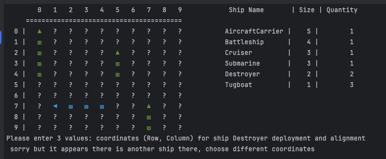

# Battleship Game

This is quite simple but same very interesting game on terms of 
programing. 
I have implemented few features in this game:
- Game has some logic, so CPU is not just randomly shooting
- Player can change Map size
- Player can adjust fleet:
  - Add more ships
  - Modify existing ones
  - Delete ship
- If user wants, also can change coordinate system from digits to letters
- 
The aim of this project is to  present my skills on Python that i have 
acquired on Code Institute "Full Stack Development" course.

[Link to live page](https://battleship-p3-8833f01f29b3.herokuapp.com)

The object of Battleship is to try and sink all of the other player's (in 
this scenario it is CPU - computer) before they sink all of your ships. 
All of the CPU ships are somewhere on its board.  You try and hit them by 
calling out the coordinates of one of the squares on the board. 
The CPU also tries to hit your ships by calling out coordinates.  Neither 
you nor the CPU can see the other's board so you must try to guess where they 
are.  Each board in the game has two grids:  the right section for 
the player's ships and the left part  for recording the 
player's guesses

## FEATURES
### MAIN PAGE
The main page features:

#### SETTINGS CHOICE INPUT
* An option to press Y to view settings before starting, or just pressing 
  enter if user doesn't need to change them. The aim of this is to give 
  user an option to change some game parameters, like map size, fleet or 
  rows and column indexes.

#### SETTINGS DISPLAYED
* This is very simple and basic settings to change:
  * Player can change Fleet:
    * Add new ships
    * Modify existing ship size and quantity of them in fleet
    * Delete all ship type (will remove all ships of that name)
  * Player can change Map size
  * Player can change indexes of maps
  * Player can Disable or Enabe gaps between ships
* To return to previous menu, player can enter 0 (zero)

### GAME PAGE
The game page features:

#### PLAYER DEPLOYS ALL SHIPS
* Program will cycle through all ships in given fleet, starting from biggest one
* Playwr has to enter 2 or 3 values based on ship size:
  * If ship size is just 1 cell, then he will he/she will be asked just for 
    2 variables:
    * Row index
    * Column Index
  * If ship size is greater then 1 cell, user will have to enter 3rd value:
    * Alignment
* User Input validation:
  * If player enters incorrect values:
    * Code will warn user if entered coordinates are out of map boundaries
    * Code will detect that ships do not overlap and warn user
    * Code also warns user if alignment is not valid, or code did not 
      understand what user tried to say
* After all ships of Player are deployed, program will deploy CPU ships

* Player deploying ship:

* Trying to deploy ship so part of it is outside of map boundaries:

* Player has to enter 3 values (ship is bigger then one cell), but enters 
  just 2:

* Trying to deploy so ships overlap:

* Deploying ship on each other:

* Entering Coordinates that are not in map:

* Output of coordinates out of map:

* After Player completes deploying all ships, CPU will deploy its own and 
  user will be prompted to do move (shoot) first:

* First attempt i have chosen 0,0, then computer made its move:

* If player tries to enter same coordinates, he/she will get returned text:

* Damaged ships are shown in red squares, till ship is not fully sunk, as we 
  do not want each part to know what alignment ship it is:

#### BATTLESHIP DISPLAY
* Default Map size is 10 by 10
* There are 2 maps displayed:
  * Left - CPU map, where player will be shooting
  * Right - Players map, showing his/her ships
* Coordinates are indexed in numbers (this can be changed in game settings)

#### SHIPS DISPLAY
* Every ship has its own color and symbol:
  * Horizontal ships are marked - Blue
  * Vertical - Green
  * If there is any Single cell ships, they will be - Yellow
* Default symbol on map is ? (question mark), as it marks unknown cell
* If shot was a Miss - it will be marked with dot in middle
* Damaged ships will be marked in RED square, they will be revealed later 
  when fully sunk.

#### USER INPUT
* Be default, user is asked to enter information separated by comma ","
* Even if player enters different separating symbol, program will try to 
  predict coordinates
* Alignment is asked to be one letter:
  * v- Vertical
  * h - Horizontal
* If player enters some mistyping in word, program will try to detect which 
  alignment it is. Yes it sounds hard, but it is there, not so much refined, 
  but Levenshtein distance works.
* Same distance is applied when player is trying to adjust the fleet. If 
  ship name was entered wrong, it will try to guess, if no luck, player will 
  be informed.
* 

### FUTURE FEATURES
* Implement more complex algorithm for CPU to find ships:
  * shoot only on odd or even coordinates (like chessboard) - reduces map 
    size in half - higher chance to find a ship
  * implement Probability Theory - when one or few ships are sunk, program 
    could start calculating of possible ship deployments with that map 
    pattern. Then choose coordinates with highest success rate to Hit
* Implement mouse - user can be just clicking mouse on screen, instead of typing
* Implement keyboard cursors - use arrows. 

## TESTING

** ** **  Please note this game will not work on mobiles as it runs on the mock terminal. (cred. Mock terminal created by Code Institute). No accessibility or responsive testing was therefore needed. ** ** **

### VALIDATOR TESTING 
* Python code tested and no significant errors shown. Code passed through:

[**CI PYTHON LINTER**](https://pep8ci.herokuapp.com/https://raw.githubusercontent.com/)

  validated run.py file: 

validated hangman.py file:

### FUNCTIONAL TESTING
|                               Input                                |            Action            |                                                                 Expected Result                                                                  |     Valid      |
|:------------------------------------------------------------------:|:----------------------------:|:------------------------------------------------------------------------------------------------------------------------------------------------:|:--------------:|
| Main page, user is prompted to type Y for Game Settings adjustment |         User types Y         |                                                  Instructions with game Adjustment is displayed                                                  |     Valid      | 
|               User is prompted to choose adhustments               |         User types F         |                                           Uswer is promted to choose ship to modify or creade new one                                            |Valid|
|                    User chooses to add new ship                    |         User types N         |                                            User is prompted to enter new ship name, size and quantity                                            |Valid|
|           To go back iser is prompted to enter 0 - zero            |        User enters 0         |                                                              Previous menu appears                                                               |Valid|
|               User wants to modify  ship from fleet                |    User eenters ship name    |                                                  User is presenterd with information with ship                                                   |Valid|
|             User is promted to delete ship from fleet              |        Uswer enters D        |                                                      Computer deletes given ship from fleet                                                      |Valid|
|                  User wants to adjust given ship                   | User enters size and Quality |                                  Coputer checks if such fleet can fit on map, if True, program creates new ship                                  |Valid|
|                  User wants to adjust given ship                   |   User Enters wrong values   |                                                            User goes to previous menu                                                            | Valid|
|              Main Menu, user wants to adjust map size              |        User enters M         |                                                 User is presented with information about new map                                                 |Valid|
|                User Is changing map to bigger size                 | User enters new Valid values |                                                                 Map size changes                                                                 |Valid|
|User wants to change map to smaller size|User enters smaller values then current map|                                               Program checks if such map is valid, returns output                                                |Valid|
|User wants to change map Row and Column Labeling - Indexes|User types I|                                                     New menu and instructtions are presented                                                     |Valid|
|User is changing indexes from numbers to letters|User types a,a|                                                      New map is generated with new indexes                                                       |Valid|
|User wants to try entering wrong values for indexes|User enters just one value - a|                                                    User is warned that program need 2 values                                                     |Valid|
|User wants to change map layout - disable gaps between ships|User enters - G|                                                       User is presented with instructions                                                        |Valid|
|User wants to disable gaps between ships| User enters - N|                                            new map is generated with ships without gaps between them                                             |Valid|
|User wants to mess up with prompt| User enters - W| Nothing happens - <program ingoners such thing, user can definately type in Y/Yes/T/True or N/No/F/Faslse | Valid|
|User just wants to start new game while on main page|User just hits Enter|Game starts|Valid|
|Ship Deployment| User enters correct Values|Ship is displayed|Valid|
|User wants to test program and enters bad information|User types not what asked for|User gets warning output|Valid|
|Main Game - User chooses coordinates to shoot|User enters coordinates 0,0|Game performs shoot action, map and results are displayed|Valid|
|Main Game - User wants to shoot to same spot again|User again enters coordinates 0,0|User gets arning output|Valid|

## TOOLS AND TECHNOLOGIES
* Python - back end programming
* Github - used to store code online
* Heroku - to deploy the app
* Pycharm - Python coding latform

### VERSION CONTROL
* Git 

    Code has been pushed with git commands to remote repository on Github with commands:
   * git add . - to add files ready to commit
   * git commit -m "message" - to commit the code to local 
    repository ready to be pushed
  * git push - final command used to push commited code to remote repo on Github
   
### IMPORTS
* I have imported and used Python packages :
  * `os` : used to clear the terminal with clear() function
  * `sys` : used to exit program
  * `random`: used to randomly select questions from word list
  * `time`: used for time related functions - timer for logging actions
  * `re`: handling user input expressions

## DEPLOYMENT
The app has been displayed thanks to template provided by Code Institue to allow others to test the code.

* The project has been deployed on Heroku as follows:
     * Use: `pip freeze > requirements.txt` to add external libraries to deployed app.
     * Create Heroku account ( step by step guide [here](https://coding-boot-camp.github.io/full-stack/heroku/deploy-with-heroku-and-mysql))
     * In the top right, click 'New'
     * Click 'Create new app'
     * Give your app a name and select your region from drop down 
     * Click 'Create new app' 
     * Go to 'settings' tab, it's important you do it before deployment
     * Scroll down to 'config vars' section and key: PORT and value: 8000
     * Scroll down to 'Buildpacks' section
     * Click 'Add buildpack'
     * Add Python as first dependency and select 'Save changes'
     * Add node.js as a second dependency and save again
     (This is settings section done)
     * Select 'Deploy' tab at the top
     * Select ' Github' from 'Deployment method'
     * type the name of how you called project in Github and click 'search'
     * Scroll down and select manual deployment method
     * Auto method has also been selected to allow the project to update every time i push the code from Gitpod
     * You can now click to view the app ready and running

## CLONING THE REPOSITORY

1. On Github navigate to repository
2. Click "Code" a green button shown right above the file list
3. Copy the URL of the repo using HTTPS, SSH OR Github CLI
4. Open Git Bash
5. Change the current working directory to the location where you want the cloned directory
6. Type git clone, and then paste the URL you copied earlier
7. Press enter to create local Clone

For more details on how to clone the remote repo in order to create a local copy for own use, please go to 
https://docs.github.com/en/repositories/creating-and-managing-repositories/cloning-a-repository

## FORKING
1. On Github navigate to repository
2. click "Fork" located towards the top right corner
3. Select "owner" for the forked repo, from the dropdown menu under "owner" Under "Owner"
4. It will create forked repo under the same name as original by default but 
   you can type a name in "Repository name" or add a description in "Description" box.
5. Click "Create fork" !

Forking allows you to make any changes without affecting original project. You can send the suggestions over by submitting pull request. Project owner can review the pull request before accepting the suggestions and merging them.

For more details on how to fork the repo, in order to for example suggest any changes to the project you can visit: 
https://docs.github.com/en/get-started/quickstart/fork-a-repo

When you have fork to a repository you don't have access to files locally on your device, for this you will need to clone the forked repo.

